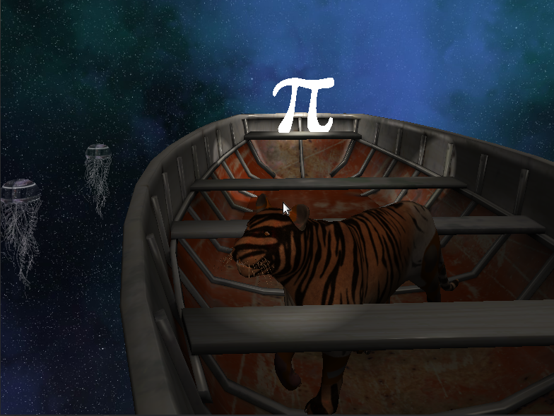
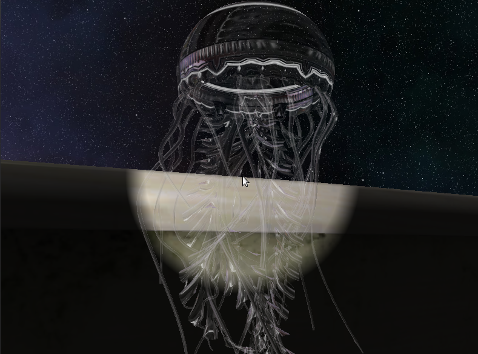
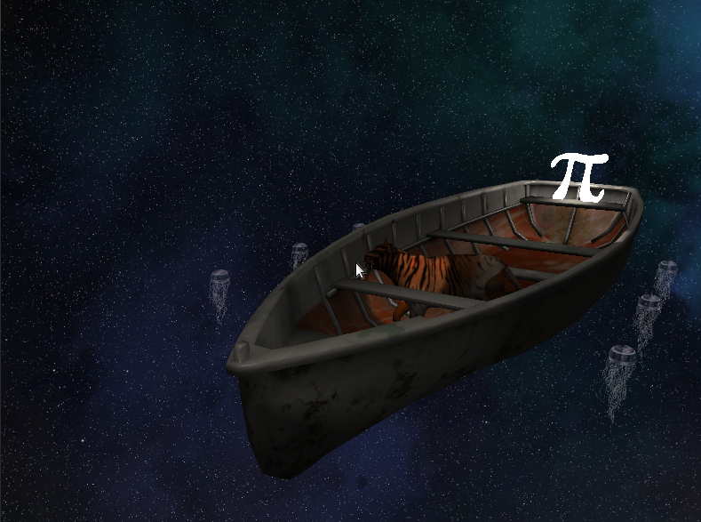
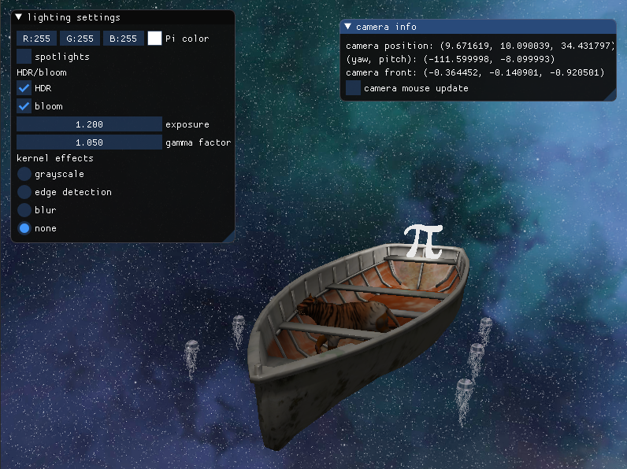
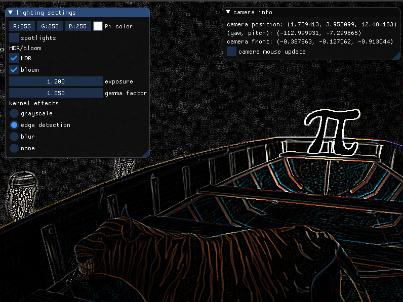

# Life of Pi
Projekat za kurs Računarska grafika na Matematičkom fakultetu u Beogradu.
([demo snimak](https://youtu.be/RAOHGmr4_7I))

Za izradu je korišćen kostur `https://github.com/matf-racunarska-grafika/project_base.git`, kao i 
materijali sa [LearnOpenGL](https://learnopengl.com/).

Korišćeni modeli su preuzeti sa [Sketchfab](sketchfab.com/) sajta.

Inspirisano filmom [Life of Pi](https://static.wikia.nocookie.net/filmguide/images/b/b8/LifeofPi.jpg/revision/latest?cb=20191211140848).

### Komande
- `W`, `A`, `S`, `D` - kretanje po sceni
- `F1` - otvara ImGui za dodatna podešavanja
- `B` - switch između Phongovog i Blinn-Phongovog modela osvetljenja
- `ESC` - izlazak iz aplikacije

### Implementirane oblasti

- Oblasti iz 1-8. nedelje
- Blending 
- Face Culling
- Advanced Lighting
- Cubemaps
- Framebuffers
- HDR
- Bloom

### Galerija

